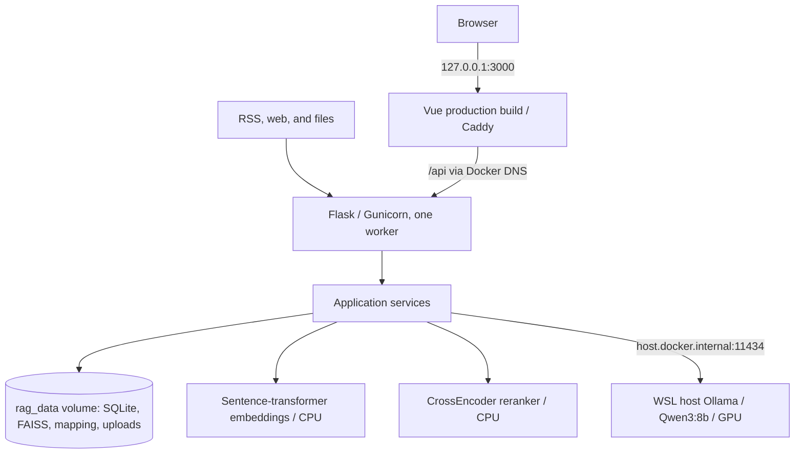
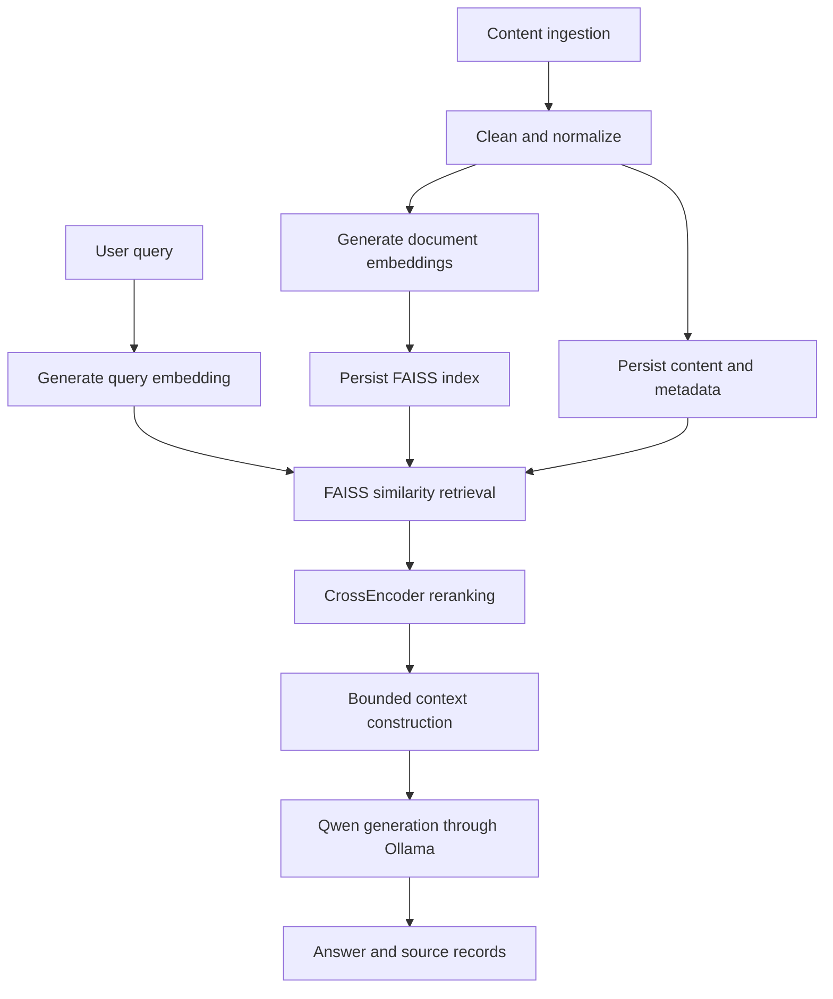

# RAG News Intelligence Platform

> A full-stack, local-first system for ingesting news content, managing a knowledge base, retrieving and reranking relevant evidence, and generating answers from retrieved context with a local LLM.

This repository is an engineering case study in RAG application design. It combines a Flask API, a Vue client, SQLite-backed knowledge management, FAISS retrieval, CrossEncoder reranking, and Qwen inference through Ollama. The implementation is production-oriented, but it is not presented as production-ready.

## Overview

RAG News Intelligence Platform turns fragmented RSS feeds, web pages, and uploaded content into a searchable local knowledge base. Users can manage sources, run semantic or keyword searches, and ask questions against retrieved evidence through a web interface.

The portfolio focus is the end-to-end engineering workflow: ingestion, persistence, vector indexing, two-stage retrieval, context construction, local generation, API integration, failure handling, and layered software testing.

## Problem

News research often spans disconnected sources and relies on exact-keyword search. That makes it difficult to organize material locally, retrieve conceptually related items, and trace an answer back to supporting records.

This project explores a reproducible local workflow that:

- ingests content from RSS feeds, web pages, and files;
- stores and manages source material as a knowledge base;
- retrieves semantically relevant records instead of relying only on exact terms;
- reranks candidates before constructing LLM context;
- runs the core AI models locally; and
- exposes the workflow through REST APIs and a browser client.

## System Architecture



Docker Compose provides the reproducible local container workflow. The frontend and backend run in separate containers, while Ollama remains a WSL host service. Native WSL development remains available for the faster edit/debug loop.

Flask blueprints define the HTTP boundary, while service modules contain authentication, ingestion, knowledge-management, retrieval, generation, analytics, and health-check logic. SQLite stores application and knowledge records; FAISS stores the corresponding vector index.

Redis, Celery, and APScheduler appear in configuration or dependencies, but they are not shown as active architecture components because the current repository does not provide sufficient runtime wiring evidence.

## RAG Pipeline



The current query path embeds the question, retrieves candidate IDs from an `IndexFlatIP` FAISS index, loads the associated records from SQLite, optionally reranks them with a CrossEncoder, builds a bounded context, and invokes Qwen through Ollama. If vector retrieval is unavailable or empty, the search service can fall back to keyword retrieval. Optional web fallback is disabled by default.

## Key Engineering Decisions

| Decision | Engineering rationale and trade-off |
| --- | --- |
| Local model execution | Hugging Face embedding and reranking models are loaded from the local cache, while Qwen is served by Ollama. This keeps the core RAG path local, at the cost of manual model provisioning and local compute requirements. |
| SQLite plus FAISS | SQLite provides simple relational persistence for users, sources, and knowledge records; FAISS provides lightweight vector similarity search. The combination is practical for a local case study, not a claim of production-scale storage. |
| Retrieval followed by reranking | FAISS narrows the candidate set efficiently; the CrossEncoder applies a more query-aware relevance pass before context construction. No claim is made that this model combination is optimal without a dedicated benchmark. |
| Keyword degradation path | Keyword retrieval keeps search behavior available when embeddings or the vector index are unavailable. This improves resilience while making the returned search type explicit. |
| Separate client, routes, and services | Vue, Flask blueprints, and backend service modules keep presentation, HTTP handling, and application logic distinct enough to test and evolve independently. |
| Two local workflows | Native WSL is the fast development path; Docker Desktop with WSL Integration and Compose is the reproducible container validation path. Ollama stays on the host so local GPU inference is not duplicated inside Compose. |
| Layered validation | Unit, integration, API, end-to-end, performance, and frontend security test modules exercise software behavior at different boundaries. Dedicated RAG quality evaluation remains future work. |

## Key Capabilities

- RSS and web ingestion, file upload, and knowledge-base CRUD operations
- Local embeddings with `all-MiniLM-L6-v2`
- FAISS semantic retrieval with keyword fallback
- CrossEncoder reranking with `ms-marco-MiniLM-L-6-v2`
- RAG question answering and streaming responses through Ollama and `qwen3:8b`
- JWT-based authentication and account-management flows
- REST APIs for knowledge, search, RAG, ingestion, analytics, upload, and health checks
- Vue-based search, chat, knowledge-management, analytics, and system-health interfaces
- Containerized backend and frontend orchestration with loopback-only host ports and persistent RAG state

## Tech Stack

| Layer | Technologies |
| --- | --- |
| Frontend | Vue 3, Vite, Element Plus, Pinia, Vue Router, Axios |
| API and application | Python, Flask, Flask-SQLAlchemy, Flask-JWT-Extended, Marshmallow |
| Data and retrieval | SQLite, FAISS, Sentence Transformers, LangChain |
| Generation | Ollama, Qwen3:8b |
| Ingestion and analysis | Requests, Beautiful Soup, Feedparser, Trafilatura, scikit-learn |
| Testing | pytest, pytest-cov, Vitest, Vue Test Utils, Playwright test specification |

## Testing & Validation

The repository contains **51 categorized test modules** rather than relying on a single happy-path demo:

| Area | Unit | Integration | API | E2E | Performance | Security | Total |
| --- | ---: | ---: | ---: | ---: | ---: | ---: | ---: |
| Backend | 12 | 5 | 8 | 6 | 4 | 0 | 35 |
| Frontend | 7 | 6 | 0 | 1 | 1 | 1 | 16 |

Backend pytest configuration includes an 80% coverage failure threshold. Frontend tooling can generate a Vitest coverage report, and the repository includes a Playwright end-to-end specification; Playwright must currently be installed separately before that specification can run.

These are repository-level test assets and configuration evidence, not a claim that every suite currently passes in CI. The automated tests primarily validate software behavior. Retrieval relevance, answer groundedness, and end-to-end RAG quality are not yet covered by a dedicated evaluation framework.

### Test commands

```bash
# Backend
cd Backend
python run_tests.py

# Frontend unit/integration/performance/security suites
cd ../Frontend
npm run test:all
npm run test:coverage

# Optional browser E2E setup
npm install -D @playwright/test
npx playwright install
npm run test:e2e
```

## Current Engineering Evidence

- The application factory registers eight Flask blueprints across auth, knowledge, search, RAG, crawler, upload, analytics, and health domains.
- The service layer implements local embedding, persistent FAISS indexing, semantic retrieval, reranking, bounded context construction, and Ollama generation.
- Knowledge records and vector mappings are synchronized through explicit service operations.
- Health and readiness endpoints inspect database and model-service state.
- The Vue client contains dedicated API modules, Pinia stores, routed views, and test suites for the principal application flows.
- The Compose workflow serves the Vue production build through Caddy, runs the backend through single-worker Gunicorn, and persists SQLite, FAISS, ID mapping, and uploads in one named volume.

No latency, throughput, retrieval-quality, or answer-quality benchmark is claimed in this phase.

## Containerized Local Workflow

### Prerequisites

- Windows 11 with WSL2 / Ubuntu 24.04
- Docker Desktop using its Linux engine, with WSL Integration enabled for Ubuntu
- Ollama running on the WSL host with `qwen3:8b` available

Do not install a second Docker Engine daemon inside Ubuntu. Ollama is deliberately not a Compose service; the backend reaches it through `host.docker.internal:11434`.

### 1. Prepare local configuration and Host Ollama

```bash
git clone https://github.com/Henric0612/rag-news-intelligence-platform.git
cd rag-news-intelligence-platform
cp .env.example .env
```

Replace the two secret placeholders in `.env` for anything beyond an isolated local demo. The file is ignored by Git.

Prepare Ollama on the WSL host:

```bash
ollama pull qwen3:8b
ollama serve
```

### 2. Validate and start the stack

The backend image provisions pinned revisions of the embedding and reranking models at build time and runs them offline at runtime.

```bash
docker compose config
docker compose build
docker compose up -d --wait
```

Open `http://127.0.0.1:3000`. This is the primary UI and API entrypoint. `http://127.0.0.1:5000` is also published on loopback for local debugging and health inspection; it is not a public production API exposure.

Useful checks:

```bash
curl http://127.0.0.1:3000/api/health
curl http://127.0.0.1:5000/api/health
curl 'http://127.0.0.1:5000/api/ready?quick=true'
curl 'http://127.0.0.1:5000/api/ready?quick=false'
```

`/api/health` is process liveness and remains healthy during a temporary AI dependency failure. Quick readiness checks the database and core configuration without initializing AI. Full readiness checks the embedding model, reranker, Host Ollama, and the expected `qwen3:8b` model; it returns HTTP 503 when a required dependency is unavailable.

For RAG failures, non-stream requests return HTTP 503 with `success:false` and `data.error_code: "AI_DEPENDENCY_UNAVAILABLE"`. Streaming requests emit a structured `type:error` event.

### 3. Persistence and lifecycle

The `rag_data` named volume stores SQLite, the FAISS index, the ID mapping, and uploads as one logical persistence boundary. Ordinary restarts and `docker compose down` / `docker compose up` preserve it.

Do not run `docker compose down -v` when the local RAG state must be retained; `-v` removes the named volume.

```bash
docker compose ps
docker compose logs backend frontend
docker compose down
```

## Native WSL Development Workflow

Native WSL remains the preferred fast development and debugging loop. It requires Python 3.13, Node.js, locally cached Hugging Face models, and the same Host Ollama service.

```bash
python -m venv .venv
source .venv/bin/activate
pip install -r Backend/requirements.txt

python -c "from sentence_transformers import SentenceTransformer; SentenceTransformer('sentence-transformers/all-MiniLM-L6-v2')"
python -c "from sentence_transformers import CrossEncoder; CrossEncoder('cross-encoder/ms-marco-MiniLM-L-6-v2')"

python -m Backend
```

In a second terminal:

```bash
cd Frontend
npm install
cp env.example .env
npm run dev
```

> **Development data warning:** `Backend/init_db.py` drops and recreates the local database before creating demo users. Do not run it against data you need to preserve.

### Development-only demo credentials

| Role | Username | Password |
| --- | --- | --- |
| Administrator | `admin` | `admin123` |
| Test user | `testuser` | `test123` |

These credentials are created only for isolated local development. They must be changed or removed before any shared or externally accessible deployment.

## Repository Structure

```text
.
├── Backend/
│   ├── Dockerfile       # Python 3.13 builder/runtime image and pinned models
│   ├── models/          # SQLAlchemy domain models
│   ├── routes/          # Flask API blueprints
│   ├── services/        # Application and AI services
│   ├── tests/           # Backend validation suites
│   └── data/            # Local SQLite, FAISS, cache, and upload paths
├── Frontend/
│   ├── Dockerfile       # Vue build and Caddy runtime image
│   ├── Caddyfile        # Static/SPA serving and /api reverse proxy
│   ├── src/             # Vue application, stores, API clients, and views
│   └── tests/           # Frontend validation suites
├── compose.yaml         # Local backend/frontend orchestration and rag_data volume
├── .env.example         # Safe Compose configuration template
├── Docs/                # Detailed academic and engineering documentation
└── Product Prototype/   # Earlier static product prototype
```

## AI-Assisted Development

This project was developed with extensive AI coding assistance.

The human engineering contribution focused on problem definition, system architecture, workflow design, technology selection, requirement decomposition, iterative implementation guidance, validation, testing, debugging, integration, and engineering review. The portfolio value of the project is intended to demonstrate engineering judgment and an AI-assisted software development workflow rather than manually authored code volume.

## Current Limitations

- SQLite and a local FAISS index target single-machine development rather than distributed production use.
- Redis, Celery, and APScheduler are not established as active runtime dependencies in the current application wiring.
- There is no repository-level CI/CD pipeline or automated quality gate execution.
- RAG evaluation is limited to software-behavior tests and a simple heuristic response score; there is no dedicated retrieval or groundedness benchmark.
- Observability is limited to application logging and health/readiness endpoints.
- Docker Desktop, WSL Integration, Host Ollama availability, and the local `qwen3:8b` model are operational prerequisites for the container workflow.
- Secrets management, TLS, deployment hardening, and production data migration are not implemented.

## Roadmap

### Phase B — Containerized RAG Stack

- **Complete:** backend and frontend containers, Compose orchestration, loopback ports, unified persistence, health/readiness, and Host Ollama integration.
- Redis remains deferred; Celery and APScheduler are not required by the demonstrated Phase B runtime.

### Phase C — CI-Tested AI Application

- Add GitHub Actions for backend and frontend tests.
- Add repeatable builds, coverage reporting, and quality gates.

### Phase D — Evaluated and Observable RAG System

- Add lightweight retrieval and reranking evaluation.
- Measure answer grounding and end-to-end latency.
- Introduce structured metrics, tracing, and operational dashboards.

### Later — AI Platform Evolution

- Evaluate Kubernetes only after container and CI foundations are stable.
- Explore production-oriented model and LLM serving, scaling, and deeper observability.

Phase B describes current capability. Phase C, Phase D, and later items remain planned evolution.

## Academic Context

This project originated as university coursework and is now being developed into an engineering portfolio case study. The emphasis is shifting from assessment-oriented feature coverage toward evidence-based RAG engineering, validation, and a credible path to production AI platform practices.
