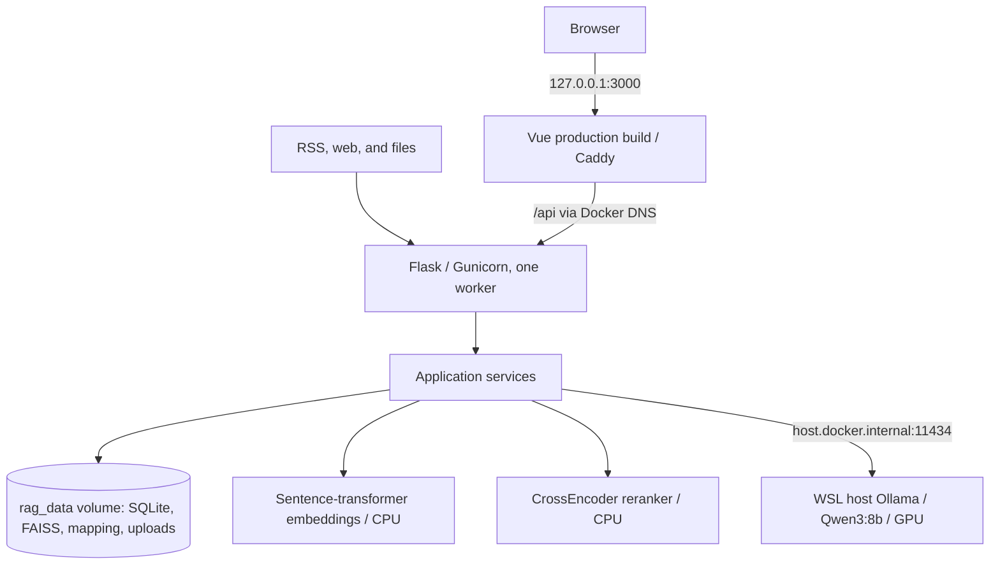
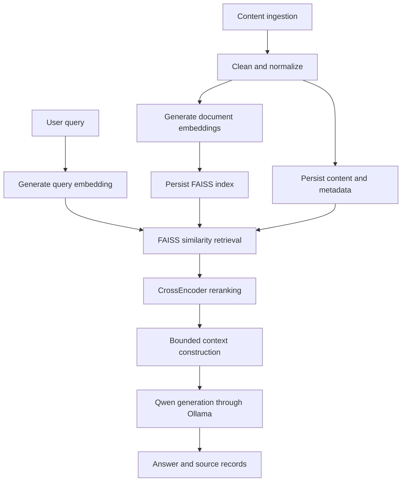

# RAG News Intelligence Platform

> A full-stack, local-first system for ingesting news content, managing a knowledge base, retrieving and reranking relevant evidence, and generating answers from retrieved context with a local LLM.

This repository is an engineering case study in RAG application design. It combines a Flask API, a Vue client, SQLite-backed knowledge management, FAISS retrieval, CrossEncoder reranking, and Qwen inference through Ollama. The implementation is production-oriented, but it is not presented as production-ready.

## Overview

RAG News Intelligence Platform turns fragmented RSS feeds, web pages, and uploaded content into a searchable local knowledge base. Users can manage sources, run semantic or keyword searches, and ask questions against retrieved evidence through a web interface.

The portfolio focus is the end-to-end engineering workflow: ingestion, persistence, vector indexing, two-stage retrieval, context construction, local generation, API integration, failure handling, and layered software testing.

## Why This Project Matters

The project evolved from an academic full-stack RAG application into a more reproducible and verifiable local AI engineering system. Phase B added explicit container boundaries, persistent state, dependency-failure semantics, and complementary native-development and container-validation workflows—it is more than a demo placed inside Docker.

Current stage: **Phase B complete; Phase C complete; Phase D is complete.** The evaluation foundation, retrieval/reranking baseline, human-reviewed answer/grounding/refusal evaluation, latency/observability work, and final protected-main exact-SHA acceptance are finished. Evidence, limitations, and the acceptance workflow are recorded in the [Phase D guide](Docs/Phase-D-Evaluation.md).

## Problem

News research often spans disconnected sources and relies on exact-keyword search. That makes it difficult to organize material locally, retrieve conceptually related items, and trace an answer back to supporting records.

This project explores a reproducible local workflow that:

- ingests content from RSS feeds, web pages, and files;
- stores and manages source material as a knowledge base;
- retrieves semantically relevant records instead of relying only on exact terms;
- reranks candidates before constructing LLM context;
- runs the core AI models locally; and
- exposes the workflow through REST APIs and a browser client.

## System Architecture


```mermaid
flowchart TB
    USER["Browser"] -->|127.0.0.1:3000| UI["Vue production build / Caddy"]
    SOURCE["RSS, web, and files"] --> API["Flask / Gunicorn, one worker"]
    UI -->|/api via Docker DNS| API
    API --> SERVICES["Application services"]
    SERVICES --> DATA[("rag_data volume: SQLite, FAISS, mapping, uploads")]
    SERVICES --> EMB["Sentence-transformer embeddings / CPU"]
    SERVICES --> RERANK["CrossEncoder reranker / CPU"]
    SERVICES -->|host.docker.internal:11434| LLM["WSL host Ollama / Qwen3:8b / GPU"]
```

Docker Compose provides the reproducible local container workflow. The frontend and backend run in separate containers, while Ollama remains a WSL host service. Native WSL development remains available for the faster edit/debug loop.

Flask blueprints define the HTTP boundary, while service modules contain authentication, ingestion, knowledge-management, retrieval, generation, analytics, and health-check logic. SQLite stores application and knowledge records; FAISS stores the corresponding vector index.

Redis, Celery, and APScheduler appear in configuration or dependencies, but they are not shown as active architecture components because the current repository does not provide sufficient runtime wiring evidence.

## RAG Pipeline


```mermaid
flowchart TB
    INGEST["Content ingestion"] --> PREP["Clean and normalize"]
    PREP --> STORE["Persist content and metadata"]
    PREP --> DOCEMB["Generate document embeddings"]
    DOCEMB --> FAISS["Persist FAISS index"]
    QUERY["User query"] --> QEMB["Generate query embedding"]
    QEMB --> RETRIEVE["FAISS similarity retrieval"]
    FAISS --> RETRIEVE
    STORE --> RETRIEVE
    RETRIEVE --> RERANK["CrossEncoder reranking"]
    RERANK --> CONTEXT["Bounded context construction"]
    CONTEXT --> GENERATE["Qwen generation through Ollama"]
    GENERATE --> ANSWER["Answer and source records"]
```

The current query path embeds the question, retrieves candidate IDs from an `IndexFlatIP` FAISS index, loads the associated records from SQLite, optionally reranks them with a CrossEncoder, builds a bounded context, and invokes Qwen through Ollama. If vector retrieval is unavailable or empty, the search service can fall back to keyword retrieval. Optional web fallback is disabled by default.

## Key Engineering Decisions

| Decision | Engineering rationale and trade-off |
| --- | --- |
| Local model execution | Hugging Face embedding and reranking models are loaded from the local cache, while Qwen is served by Ollama. This keeps the core RAG path local, at the cost of manual model provisioning and local compute requirements. |
| SQLite plus FAISS | SQLite provides simple relational persistence for users, sources, and knowledge records; FAISS provides lightweight vector similarity search. The combination is practical for a local case study, not a claim of production-scale storage. |
| Retrieval followed by reranking | FAISS narrows the candidate set efficiently; the CrossEncoder applies a more query-aware relevance pass before context construction. No claim is made that this model combination is optimal without a dedicated benchmark. |
| Keyword degradation path | Keyword retrieval keeps search behavior available when embeddings or the vector index are unavailable. This improves resilience while making the returned search type explicit. |
| Separate client, routes, and services | Vue, Flask blueprints, and backend service modules keep presentation, HTTP handling, and application logic distinct enough to test and evolve independently. |
| Two local workflows | Native WSL is the fast development path; Docker Desktop with WSL Integration and Compose is the reproducible container validation path. Ollama stays on the host so local GPU inference is not duplicated inside Compose. |
| Layered validation | Unit, integration, API, end-to-end, performance, and frontend security test modules exercise software behavior at different boundaries. Phase D adds a fixed synthetic evaluation dataset, manual answer review, and request/stage observability; real AI measurements remain informational. |

## Key Capabilities

- RSS and web ingestion, file upload, and knowledge-base CRUD operations
- Local embeddings with `all-MiniLM-L6-v2`
- FAISS semantic retrieval with keyword fallback
- CrossEncoder reranking with `ms-marco-MiniLM-L-6-v2`
- RAG question answering and streaming responses through Ollama and `qwen3:8b`
- JWT-based authentication and account-management flows
- REST APIs for knowledge, search, RAG, ingestion, analytics, upload, and health checks
- Vue-based search, chat, knowledge-management, analytics, and system-health interfaces
- Containerized backend and frontend orchestration with loopback-only host ports and persistent RAG state

## Tech Stack

| Layer | Technologies |
| --- | --- |
| Frontend | Vue 3, Vite, Element Plus, Pinia, Vue Router, Axios |
| API and application | Python, Flask, Flask-SQLAlchemy, Flask-JWT-Extended, Marshmallow |
| Data and retrieval | SQLite, FAISS, Sentence Transformers, LangChain |
| Generation | Ollama, Qwen3:8b |
| Ingestion and analysis | Requests, Beautiful Soup, Feedparser, Trafilatura, scikit-learn |
| Testing | pytest, pytest-cov, Vitest, Vue Test Utils, Playwright test specification |

## Testing & Validation

The repository contains **57 categorized test modules** rather than relying on a single happy-path demo:

| Area | Unit | Integration | API | E2E | Performance | Security | Total |
| --- | ---: | ---: | ---: | ---: | ---: | ---: | ---: |
| Backend | 17 | 5 | 8 | 6 | 4 | 0 | 40 |
| Frontend | 8 | 6 | 0 | 1 | 1 | 1 | 17 |

Daily GitHub Actions CI requires deterministic Backend tests marked `ci` and the Frontend Unit + Integration contract (`npm run test:ci`). Both produce coverage reports; report generation is required, while coverage percentages are informational. CI also builds the production frontend and its Docker image, and validates Compose configuration. A separate manual workflow validates the full Backend image.

The table counts repository test assets, not suites required to pass in CI. Other Backend suites and Frontend security/performance tests are local-only assets; Browser E2E remains deferred. GitHub CI uses mocked AI dependencies and temporary SQLite, while real models, FAISS retrieval, reranking, Ollama/GPU, and RAG behavior require local WSL/Compose validation. Phase D evaluates retrieval/reranking and answer grounding on 24 fixed fictional records and 30 questions, using deterministic checks plus Human Review. This reproducible corpus does not represent production news quality.

Current counts describe versioned test modules, not collected or passing test cases. Commands, prerequisites, and evidence boundaries are maintained in the [Phase C CI guide](Docs/Phase-C-CI.md), [Backend implementation reference](Backend/README.md#testing), and [Frontend implementation reference](Frontend/README.md#testing).

## Current Engineering Evidence

- The application factory registers eight Flask blueprints across auth, knowledge, search, RAG, crawler, upload, analytics, and health domains.
- The service layer implements local embedding, persistent FAISS indexing, semantic retrieval, reranking, bounded context construction, and Ollama generation.
- Knowledge records and vector mappings are synchronized through explicit service operations.
- Health and readiness endpoints inspect database and model-service state.
- The Vue client contains dedicated API modules, Pinia stores, routed views, and test suites for the principal application flows.
- The Compose workflow serves the Vue production build through Caddy, runs the backend through single-worker Gunicorn, and persists SQLite, FAISS, ID mapping, and uploads in one named volume.

Accepted Phase D evidence includes Recall@20 of 0.9464, same-candidate nDCG@5 of 0.7845 → 0.7684 after reranking, and a reviewed answer/refusal baseline. Reranking did not improve the aggregate baseline. Four warm observations per mode yielded normal total p50/p95 of 6136.77/10487.93 ms and streaming application TTFT p50/p95 of 5838.51/9529.38 ms on an RTX 4060 Laptop GPU. These are informational local observations, not SLOs or throughput claims. Exact values, provenance, failures and reproduction are in the [Phase D guide](Docs/Phase-D-Evaluation.md).

## Quick Start: Containerized Local Workflow

### Prerequisites

- Windows 11 with WSL2 / Ubuntu 24.04
- Docker Desktop using its Linux engine, with WSL Integration enabled for Ubuntu
- Ollama running on the WSL host with `qwen3:8b` available

Do not install a second Docker Engine daemon inside Ubuntu. Ollama is deliberately not a Compose service; the backend reaches it through `host.docker.internal:11434`.

### 1. Prepare local configuration and Host Ollama

```bash
git clone https://github.com/Henric0612/rag-news-intelligence-platform.git
cd rag-news-intelligence-platform
cp .env.example .env
```

Replace both secret placeholders in `.env`; Compose intentionally fails configuration when either value is missing. The file is ignored by Git.

Prepare Ollama on the WSL host:

```bash
ollama pull qwen3:8b
ollama serve
```

### 2. Validate and start the stack

```bash
docker compose config --quiet
docker compose up -d --build --wait
```

Open `http://127.0.0.1:3000`, then perform one lightweight liveness check:

```bash
curl http://127.0.0.1:3000/api/health
```

The backend image provisions fixed revisions of the embedding and reranking models and uses them offline at runtime. For readiness semantics, RAG failure responses, persistence lifecycle warnings, native Python setup, and backend tests, see [Backend/README.md](Backend/README.md). For Vite development, `/api` proxying, frontend tests, and Caddy serving, see [Frontend/README.md](Frontend/README.md).

## Repository Structure

```text
.
├── Backend/
│   ├── Dockerfile       # Python 3.13 builder/runtime image and pinned models
│   ├── models/          # SQLAlchemy domain models
│   ├── routes/          # Flask API blueprints
│   ├── services/        # Application and AI services
│   ├── tests/           # Backend validation suites
│   └── data/            # Local SQLite, FAISS, cache, and upload paths
├── Frontend/
│   ├── Dockerfile       # Vue build and Caddy runtime image
│   ├── Caddyfile        # Static/SPA serving and /api reverse proxy
│   ├── src/             # Vue application, stores, API clients, and views
│   └── tests/           # Frontend validation suites
├── compose.yaml         # Local backend/frontend orchestration and rag_data volume
├── .env.example         # Safe Compose configuration template
├── Docs/                # Detailed academic and engineering documentation
└── product-prototype/   # Earlier static product prototype
```

## AI-Assisted Development

This project was developed with extensive AI coding assistance.

The human engineering contribution focused on problem definition, system architecture, workflow design, technology selection, requirement decomposition, iterative implementation guidance, validation, testing, debugging, integration, and engineering review. The portfolio value of the project is intended to demonstrate engineering judgment and an AI-assisted software development workflow rather than manually authored code volume.

## Current Limitations

- SQLite and a local FAISS index target single-machine development rather than distributed production use.
- Redis, Celery, and APScheduler are not established as active runtime dependencies in the current application wiring.
- GitHub CI validates software contracts and builds, while real Ollama/GPU behavior remains a local validation responsibility.
- Phase D evaluation uses a fixed synthetic corpus and rule diagnostics plus Human Review. It does not establish real-news production quality or sentence-level citation correctness; the runtime heuristic response score remains separate from evaluation ground truth.
- Observability includes correlated metadata events, stage timing and admin-only process-local metrics. Restart clears metrics; historical collection, exporters and dashboards remain deferred.
- Docker Desktop, WSL Integration, Host Ollama availability, and the local `qwen3:8b` model are operational prerequisites for the container workflow.
- Secrets management, TLS, deployment hardening, and production data migration are not implemented.

## Roadmap

### Phase B — Containerized RAG Stack

- **Complete:** backend and frontend containers, Compose orchestration, loopback ports, unified persistence, health/readiness, and Host Ollama integration.
- Redis remains deferred; Celery and APScheduler are not required by the demonstrated Phase B runtime.

### Phase C — CI-Tested AI Application

- **Complete:** daily GitHub Actions contracts, coverage reporting, frontend production/image builds, Compose static validation, on-demand Backend image validation, and a protected `main` PR gate.
- Merges to `main` require a PR and the four strict checks `backend-contracts`, `frontend-contracts`, `frontend-image`, and `compose-config`; no additional reviewer approval is required.

### Phase D — Evaluated and Observable RAG System

- **Complete:** versioned synthetic evaluation, retrieval/reranking comparison, human answer/grounding/refusal review, repeatability observations, stage timing and request correlation.
- Normal and streaming RAG expose metadata events and an admin-only process-local `/api/rag/metrics` endpoint; restart clears metrics.
- Local native and isolated Compose validation passed, and final acceptance was completed through the protected-main PR workflow with Daily CI plus Backend Image Validation on the exact final main SHA. See the [Phase D guide](Docs/Phase-D-Evaluation.md).
- Independent real-news validation, chunking/retrieval improvements and exporters/collectors/dashboards remain deferred.

### Later — AI Platform Evolution (Deferred)

- Evaluate Kubernetes only after container and CI foundations are stable.
- Explore production-oriented model and LLM serving, scaling, and deeper observability.

Phase D records measured capabilities and limitations of the existing pipeline. Later items remain future work.

## Academic Context

This project originated as university coursework and is now being developed into an engineering portfolio case study. The emphasis is shifting from assessment-oriented feature coverage toward evidence-based RAG engineering, validation, and a credible path to production AI platform practices.
